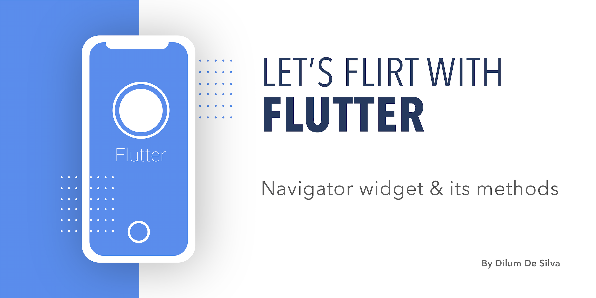

## Flutter Navigation 

Under flutter navigation we will be disscussing following sub topics.

1. How screens are stacked in Flutter.
2. How to navigate back and forth among screens.

	2.1 Simple Routing 
	
	2.2 Named Routing 
	
3. How to send data back and forth while navigating among screens.

	3.1 Data passing while simple routing 
	
	3.2 Data passing while named routing  

### 1. How screens are stacked in Flutter
In flutter we identify screens as **'routes'** so, if we are talking about the home screen or the first screen, we are refering to the first route or the initial route of our application. 

Flutter has provided **[navigator widget](https://api.flutter.dev/flutter/widgets/Navigator-class.html)** and its methods to naviagate among screens. Furthermore in flutter **navigator widget** maintains all the **routes** (screens) as stack. Also, as we all know stacks follow the concept of **LIFO** /Last In First Out. In Flutter also we have the same concept to manage the screens/routes stack

Basically, when you lunch the **first screen or route in Flutter**, In case of **android this route is know as activity** and in **iOS** it is known as **ViewController**.

#### 2.1 Simple Routing 
If you want to navigate to new page or if you want to navigate to the previous page/route/screen we user methods which has been exposed by the Flutter Navigator class/widget.  So, **push and pop** are the simplest methods that we can use to navigate back and forth among screens.

- **Push:** The push method is used to add another route onto the top of the current stack. The new page is displayed over the previous one.

      onPressed: (){  
	      Navigator.push(context, new MaterialPageRoute(  
			  builder: (context) => Page2()  
	      ));  
      }
    

- **Pop:** Since the Navigator works like a stack, it uses the LIFO (Last-In, First-Out) principle. The pop method removes the topmost route from the stack. This displays the previous page to the user.

      onPressed: (){  
	      Navigator.pop(context);
	  }

#### 2.2 Named Routing
